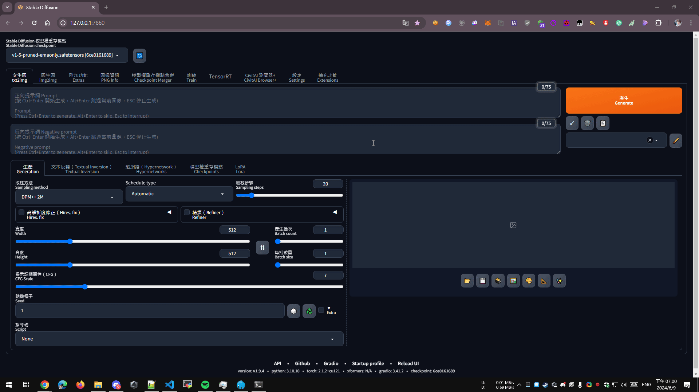

# Foreword
> This repository is a fork of the NVIDIA [Stable-Diffusion-WebUI-TensorRT](https://github.com/NVIDIA/Stable-Diffusion-WebUI-TensorRT) repository.  
> And this repository will Enhanced some features and fix some bugs. If you have any questions, please feel free to open an issue. issue please make sure to provide detailed information about the issue you are facing.  
> If you feel this repository is helpful to you, May give me a star or buy me a [coffee](https://ko-fi.com/yomisana) I will gladful :D

# TensorRT Extension for Stable Diffusion

This extension enables the best performance on NVIDIA RTX GPUs for Stable Diffusion with TensorRT.
You need to install the extension and generate optimized engines before using the extension. Please follow the instructions below to set everything up.
Supports Stable Diffusion 1.5,2.1, SDXL, SDXL Turbo, and LCM. For SDXL and SDXL Turbo, we recommend using a GPU with 12 GB or more VRAM for best performance due to its size and computational intensity. 

# DEMO
- Fix Tab TensorRT LoRA refresh lora checkpoints list(can hot reload)

- Add lora not available will auto export lora


## Features
1. TensorRT LoRA tab - hot reload(refresh) LoRA checkpoints.
2. When using TensorRT LoRA to generate, the console displays the initial loading TensorRT LoRA data progress bar.
3. Fixed TensorRT LORA's inability to read subdirectories under the LORA directory and the inability to read files with parentheses and dots in their names.
4. Add a new feature to automatically export LoRA when the selected LoRA is not available.
## Installation
Example instructions for Automatic1111:

1. Start the webui.bat
2. Select the Extensions tab and click on Install from URL
3. Copy the link to this repository and paste it into URL for extension's git repository
4. Click Install

## ISSUE FIXED
- if you pop the error message like this:
```
> The procedure entry point ... in the dynamic link library ... your_sdw_path\venv\Lib\site-packages\nvidia\cudnn\bin\cudnn64_8.dll some error like this message
```
A: Just this path ``your_sdw_path\venv\Lib\site-packages\nvidia\cudnn\bin\`` create backup folder and move all file to backup folder. And try to run the webui.bat again.

## How to use

1. Click on the “Generate Default Engines” button. This step takes 2-10 minutes depending on your GPU. You can generate engines for other combinations.
2. Go to Settings → User Interface → Quick Settings List, add sd_unet. Apply these settings, then reload the UI.
3. Back in the main UI, select “Automatic” from the sd_unet dropdown menu at the top of the page if not already selected.
4. You can now start generating images accelerated by TRT. If you need to create more Engines, go to the TensorRT tab.

Happy prompting!

### LoRA

To use LoRA / LyCORIS checkpoints they first need to be converted to a TensorRT format. This can be done in the TensorRT extension in the Export LoRA tab.
1. Select a LoRA checkpoint from the dropdown.
2. Export. (This will not generate an engine but only convert the weights in ~20s)
3. You can use the exported LoRAs as usual using the prompt embedding.


## More Information

TensorRT uses optimized engines for specific resolutions and batch sizes. You can generate as many optimized engines as desired. Types:
- The "Export Default Engines” selection adds support for resolutions between `512 x 512` and 768x768 for Stable Diffusion 1.5 and 2.1 with batch sizes 1 to 4. For SDXL, this selection generates an engine supporting a resolution of `1024 x 1024` with a batch size of `1`.
- Static engines support a single specific output resolution and batch size.
- Dynamic engines support a range of resolutions and batch sizes, at a small cost in performance. Wider ranges will use more VRAM.
- The first time generating an engine for a checkpoint will take longer. Additional engines generated for the same checkpoint will be much faster. 

Each preset can be adjusted with the “Advanced Settings” option. More detailed instructions can be found [here](https://nvidia.custhelp.com/app/answers/detail/a_id/5487/~/tensorrt-extension-for-stable-diffusion-web-ui).

### Common Issues/Limitations

**HIRES FIX**: If using the hires.fix option in Automatic1111 you must build engines that match both the starting and ending resolutions. For instance, if the initial size is `512 x 512` and hires.fix upscales to `1024 x 1024`, you must generate a single dynamic engine that covers the whole range. 

**Resolution**: When generating images, the resolution needs to be a multiple of 64. This applies to hires.fix as well, requiring the low and high-res to be divisible by 64.

**Failing CMD arguments**:

- `medvram` and `lowvram` Have caused issues when compiling the engine.
- `api` Has caused the `model.json` to not be updated. Resulting in SD Unets not appearing after compilation.
- Failing installation or TensorRT tab not appearing in UI: This is most likely due to a failed install. To resolve this manually use this [guide](https://github.com/NVIDIA/Stable-Diffusion-WebUI-TensorRT/issues/27#issuecomment-1767570566).

## Requirements
Driver:

 Linux: >= 450.80.02
- Windows: >= 452.39

We always recommend keeping the driver up-to-date for system wide performance improvements.
(This repository is only tested on Windows 10)

## Star History

[](https://star-history.com/#Yomisana/Stable-Diffusion-WebUI-TensorRT-Enhanced&Date)